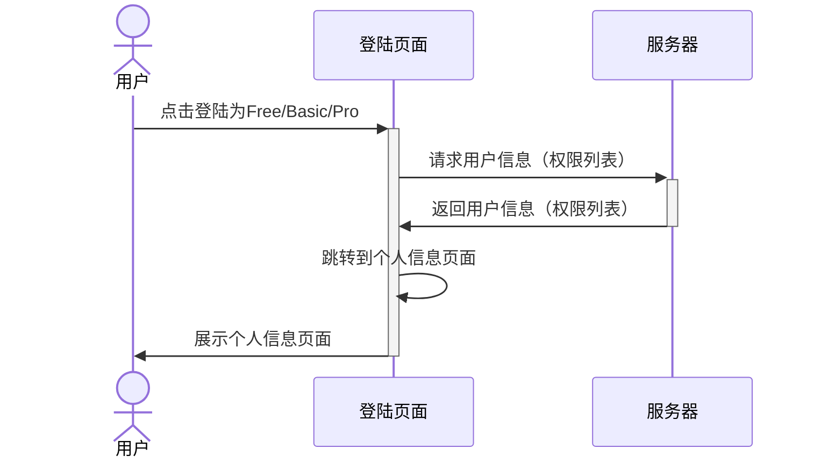

# 用户系统 设计笔记

基于 ABAC 的用户系统。 [为什么选择 ABAC。](adr/2022-05-02-access-control.md)

## 访问控制策略：

使用标签定义用户权限，标签值表示用户可以使用的数量。all 表示不限制数量。

### 资源访问控制策略设置

- `profile`: 任何已登陆用户可以访问
- `team member`： 拥有 access-team-member 标签的用户可以访问。
- `workspace`：拥有 access-workspace 标签的用户可以访问。

### 资源组设置

- `free`: 无任何标签
- `basic`: 拥有 access-team-member=5 标签
- `pro `: 拥有 access-team-member=10 access-workspace=10 标签
- `basic-updated`(演示修改资源组): 拥有 access-team-member=5 access-workspace=5 标签

## 流程设计

### 登录

## 技术实现

### 模型：

- `user`: id, email, role, accessTags
- `team member`: id, ownerId, email, createdAt
- `role`: id, name, accessTags
- `workspace`: id, ownerId, name, createdAt

## Api list

### 登陆

- `get` `/api/auth/signin`: 登陆
  - 使用静态用户数据
  - 返回用户信息（权限列表）。
    - 合并角色拥有的权限列表
  - sesson + cookie 实现身份认证

### 团队

- `get` `/api/team-members`: 获取团队成员列表
- `post` `/api/team-members`: 添加团队成员
- `delete` `/api/team-members`: 删除团队成员

### Workspace

- `get` `/api/workspaces`: 获取 Workspace 列表
- `post` `/api/workspaces`: 添加 Workspace
- `delete` `/api/workspaces`: 删除 Workspace

## 页面列表

- 登陆页面
  - 展示 4 个按钮，登录为 Free/Basic/Pro/Basic-Updated
  - 点击按钮后请求登陆，返回用户信息（权限列表）。
- 个人信息页面
  - 展示用户信息：邮箱、当前 role(aka Plan)、权限列表
  - 根据权限展示导航链接
- 团队成员页面
  - 添加按钮
  - data table
    - email、createdAt、删除按钮
  - 添加成员 form modal
    - email 输入框(不做验证)
    - 提交按钮
      - 点击后 post 数据
      - 成功后
        - 关闭 modal
        - 刷新 data table
      - 不允许添加重复的 email、提示用户已存在
  - 删除成员 popover
    - 展示警告信息
    - 确认按钮
      - 点击后 delete 数据
      - 成功后
        - 关闭 popover
        - 刷新 data table
- Workspace 页面和团队成员页面类似

## assessment 没有提到的问题

- team member 的访问控制策略
- 一个用户可不可以属于多个 team？ 例如 team member 提升为 member
- login verification code: id, userId, code, isUsed, updatedAt, createdAt
