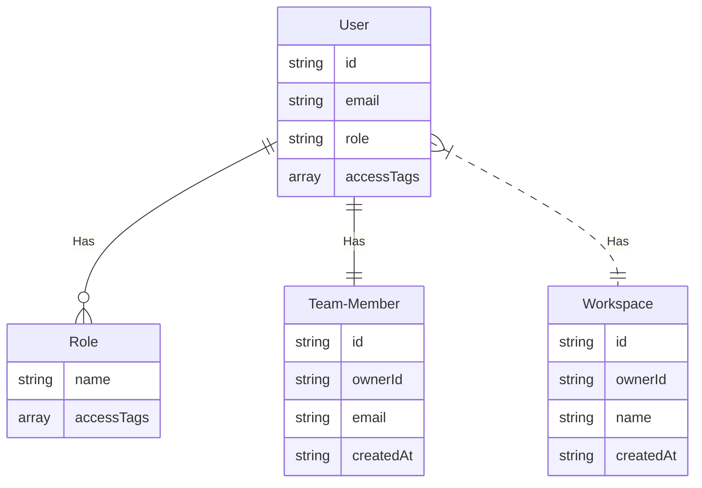

# Membership System Demo
 
## 如何运行

TODO docker-compose

## 测试指南

## 实现原理
- 基于 Session, Cookie 实现身份验证
- 基于 [ABAC](https://en.wikipedia.org/wiki/Attribute-based_access_control) 实现灵活的访问控制 
  - `用户` 被赋某个 `Role`/Plan 
  - `Role` 拥有动态的 `accessTags`（权限列表），可以通过修改 `accessTags` 来控制`用户`的可用`资源 `
    - 例如： 
    - `pro` 拥有 access-team-member=10 和 access-workspace=10 标签（权限列表）
    - `basic` 拥有 access-team-member=5 标签（权限列表）
  - `资源`拥有静态的 `accessTags`，同时拥有这些 `accessTags` 的`用户`才可以访问此`资源`
    - 如果`用户`不匹配此`资源`的 `accessTags`：
      - 前端直接隐藏此资源的访问连接
      - 后端抛 403 异常

## ER Diagram

## 开发环境
- Linux
- Visual Studio Code
  - [Developing inside a Container](https://code.visualstudio.com/docs/remote/containers)

## 技术栈

### 后端
- [NestJS](https://nestjs.com/)
- [Passport.js](https://www.passportjs.org/)
- [Lowdb](https://www.npmjs.com/package/lowdb/v/1.0.0)

### 前端
- [React](https://reactjs.org/)
- [Ant Design](https://ant.design/)
- [Zustand](https://github.com/pmndrs/zustand)
- [SWR](https://swr.vercel.app)
- [Ky](https://github.com/sindresorhus/ky)

## Links
- [设计笔记](./docs/design-note.md)
- [为什么选择 ABAC?](adr/2022-05-02-access-control.md)

- [什么是适用于 AWS 的 ABAC？](https://docs.aws.amazon.com/zh_cn/IAM/latest/UserGuide/introduction_attribute-based-access-control.html)