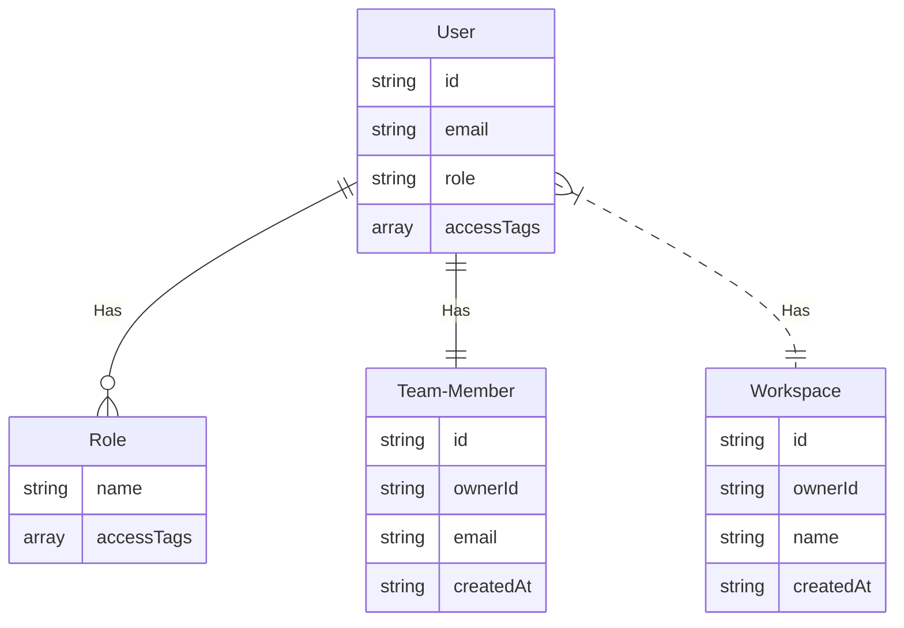

# Membership System Demo

## 如何运行

1. clone 代码到本地 `git clone https://github.com/langtube/membership-system-demo membership-system-demo`
2. 切换到代码目录 `cd membership-system-demo`
3. 启动 docker `docker-compose up`

### 重新编译

运行代码根目录运行

1. 赋予执行权限 `chmod +x ./build.sh `
2. 执行 `./build.sh`

## 如何体验

1. 启动 docker 后可打开 http://localhost:3003 体验 Web App，
   或 打开 http://localhost:3003/api/doc 直接测试 API
2. 登录页有三个按钮，可分别登录为相关权限的用户
3. 点击页面右上角的`切换用户`按钮返回登录页

## 实现原理

- 基于 Session, Cookie 实现身份验证
- 基于 [ABAC](https://en.wikipedia.org/wiki/Attribute-based_access_control) 实现灵活的访问控制
  - `用户` 被赋某个 `Role`/Plan
  - `Role` 拥有动态的 `accessTags`（权限列表），可以通过修改 `accessTags` 来控制`用户`的可用`资源 `
    - 例如：
    - `pro` 角色的 `accessTags`： access-team-member=10 和 access-workspace=10
    - `basic` 角色的 `accessTags`： access-team-member=5
  - `资源`拥有静态的(代码硬编码) `accessTags`
    - 例如 Workspace 功能的 `accessTags` 是： access-workspace
    - `用户`的 `accessTags` 完全匹配`资源`的 `accessTags` ，才可以访问
    - 如果不匹配：
      - 前端直接隐藏此资源的访问连接
      - 后端抛 403 异常

### 了解更多

- [详细设计](./docs/design-note.md)
- [为什么选择 ABAC?](adr/2022-05-02-access-control.md)

## ER Diagram

## 开发环境

- Linux
- Visual Studio Code
  - [Developing inside a Container](https://code.visualstudio.com/docs/remote/containers)

## 技术栈

### 后端

- Web Framework: [NestJS](https://nestjs.com/)
- 身份验证： [Passport.js](https://www.passportjs.org/)
- 数据库： [Lowdb](https://www.npmjs.com/package/lowdb/v/1.0.0)

### 前端

- 基础框架： [React](https://reactjs.org/)
- UI 库： [Ant Design](https://ant.design/)
- 状态管理：[Zustand](https://github.com/pmndrs/zustand)
- 获取数据：[SWR](https://swr.vercel.app)
- Http Client: [Ky](https://github.com/sindresorhus/ky)

## Links

- [什么是适用于 AWS 的 ABAC？](https://docs.aws.amazon.com/zh_cn/IAM/latest/UserGuide/introduction_attribute-based-access-control.html)

## TODO

- 补充测试
